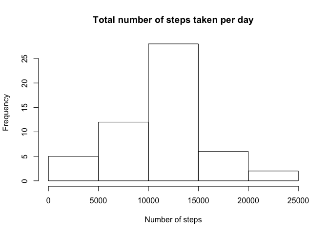
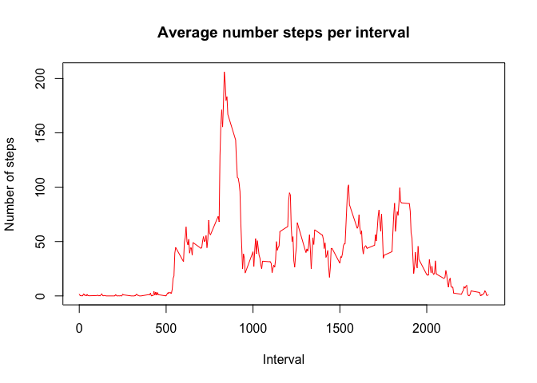
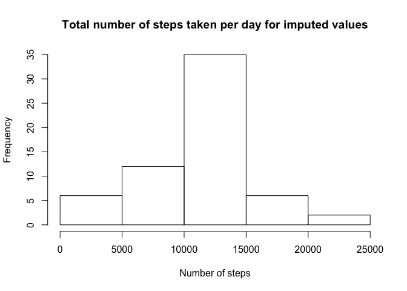
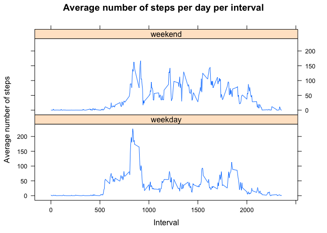

# Reproducible Research: Peer Assessment 1

```r
library(lattice)
```

## Loading and preprocessing the data
* Load the data (i.e. $$\color{red}{\verb|read.csv()|}$$)
* Process/transform the data (if necessary) into a format suitable for your analysis

```r
# unzip zip file to get csv into data directory
unzip("activity.zip")
activity <- read.csv("activity.csv", stringsAsFactors = FALSE)
View(activity)

# examination of the file
str(activity)
```

```
## 'data.frame':	17568 obs. of  3 variables:
##  $ steps   : int  NA NA NA NA NA NA NA NA NA NA ...
##  $ date    : chr  "2012-10-01" "2012-10-01" "2012-10-01" "2012-10-01" ...
##  $ interval: int  0 5 10 15 20 25 30 35 40 45 ...
```

```r
summary(activity)
```

```
##      steps            date              interval     
##  Min.   :  0.00   Length:17568       Min.   :   0.0  
##  1st Qu.:  0.00   Class :character   1st Qu.: 588.8  
##  Median :  0.00   Mode  :character   Median :1177.5  
##  Mean   : 37.38                      Mean   :1177.5  
##  3rd Qu.: 12.00                      3rd Qu.:1766.2  
##  Max.   :806.00                      Max.   :2355.0  
##  NA's   :2304
```
## What is mean total number of steps taken per day?
* Calculate the total number of steps taken per day
* If you do not understand the difference between a histogram and a barplot, research the difference between them. Make a histogram of the total number of steps taken each day
* Calculate and report the mean and median of the total number of steps taken per day

```r
# aggregate steps by date
stepsPerDay <- aggregate(steps ~ date, activity, sum)

# histogram
hist(stepsPerDay$steps, main = "Total number of steps taken per day", xlab = "Number of steps")
```

<!-- -->

```r
# mean and median
stepMean <- mean(stepsPerDay$steps)
stepMedian <- median(stepsPerDay$steps)

paste("mean:", stepMean, sep = " ")
```

```
## [1] "mean: 10766.1886792453"
```

```r
paste("median:", stepMedian, sep = " ")
```

```
## [1] "median: 10765"
```
## What is the average daily activity pattern?
* Make a time series plot (i.e. $$\color{red}{\verb|type = "l"|}$$) of the 5-minute interval (x-axis) and the average number of steps taken, averaged across all days (y-axis)
* Which 5-minute interval, on average across all the days in the dataset, contains the maximum number of steps?

```r
# aggregate average steps over 5 minute intervals
stepsMeanInterval <- aggregate(steps ~ interval, activity, mean)

# time series plot
plot(stepsMeanInterval$interval, stepsMeanInterval$steps, type = "l", col = "red", xlab = "Interval", ylab = "Number of steps", main = "Average number steps per interval")
```

<!-- -->

```r
# maximum number of steps 
maxSteps <- stepsMeanInterval[which.max(stepsMeanInterval$steps), 1]
paste("maximum number of steps:", maxSteps, sep = " ")
```

```
## [1] "maximum number of steps: 835"
```
## Imputing missing values
* Calculate and report the total number of missing values in the dataset (i.e. the total number of rows with $$\color{red}{\verb|NA|}$$s)
* Devise a strategy for filling in all of the missing values in the dataset. The strategy does not need to be sophisticated. For example, you could use the mean/median for that day, or the mean for that 5-minute interval, etc.
* Create a new dataset that is equal to the original dataset but with the missing data filled in.
* Make a histogram of the total number of steps taken each day and Calculate and report the mean and median total number of steps taken per day. Do these values differ from the estimates from the first part of the assignment? What is the impact of imputing missing data on the estimates of the total daily number of steps?

```r
# calculate missing 
sumIncomplete <- sum(!complete.cases(activity))

paste("sumIncomplete:", sumIncomplete, sep = " ")
```

```
## [1] "sumIncomplete: 2304"
```

```r
# use mean for day to fill in missing values
imputedValues <- transform(activity, steps = ifelse(is.na(activity$steps), stepsMeanInterval$steps[match(activity$interval, stepsMeanInterval$interval)], activity$steps))
View(imputedValues)

# replace NA's for 2012-10-01 with 0's
imputedValues[as.character(imputedValues$date) == "2012-10-01", 1] <- 0

# recalculate steps by day
# aggregate steps by date
stepsPerDayImputed <- aggregate(steps ~ date, imputedValues, sum)

# histogram
hist(stepsPerDayImputed$steps, main = "Total number of steps taken per day for imputed values", xlab = "Number of steps")
```

<!-- -->

```r
# create histogram to see if differ from first part of assignment and to see what the impact of imputing missing values on estimates have on total daily number of steps
hist(stepsPerDay$steps, main = "Total number of steps taken per day", xlab = "Number of steps")
```

<!-- -->

```r
# calculate imputed mean and median
stepMeanImputed <- mean(stepsPerDayImputed$steps)
stepMedianImputed <- median(stepsPerDayImputed$steps)

paste("mean:", stepMeanImputed, sep = " ")
```

```
## [1] "mean: 10589.6937828642"
```

```r
paste("median:", stepMedianImputed, sep = " ")
```

```
## [1] "median: 10766.1886792453"
```

```r
# calculate the difference between imputed values and previous
stepMeanDiff <- stepMeanImputed - stepMean
stepMedianDiff <- stepMedianImputed - stepMedian

paste("meanDiff:", stepMeanDiff, sep = " ")
```

```
## [1] "meanDiff: -176.494896381069"
```

```r
paste("medianDiff:", stepMedianDiff, sep = " ")
```

```
## [1] "medianDiff: 1.1886792452824"
```

```r
# calculate the difference in sums
diffSums <- sum(stepsPerDayImputed$steps) - sum(stepsPerDay$steps)

paste("diffSum:", diffSums, sep = " ")
```

```
## [1] "diffSum: 75363.320754717"
```
## Are there differences in activity patterns between weekdays and weekends?
* Create a new factor variable in the dataset with two levels – “weekday” and “weekend” indicating whether a given date is a weekday or weekend day.
* Make a panel plot containing a time series plot (i.e. $$\color{red}{\verb|type = "l"|}$$) of the 5-minute interval (x-axis) and the average number of steps taken, averaged across all weekday days or weekend days (y-axis). See the README file in the GitHub repository to see an example of what this plot should look like using simulated data.

```r
weekDays <- c("Monday", "Tuesday", "Wednesday", "Thursday", "Friday")

# create new column for day
imputedValues$day = as.factor(ifelse(is.element(weekdays(as.Date(imputedValues$date)), weekDays), "weekday", "weekend"))

# aggregate average steps over 5 minute intervals
stepsMeanIntervalImputed <- aggregate(steps ~ interval + day, imputedValues, mean)

xyplot(stepsMeanIntervalImputed$steps ~ stepsMeanIntervalImputed$interval | stepsMeanIntervalImputed$day, main = "Average number of steps per day per interval", xlab = "Interval", ylab = "Average number of steps", layout = c(1, 2), type = "l")
```

<!-- -->
